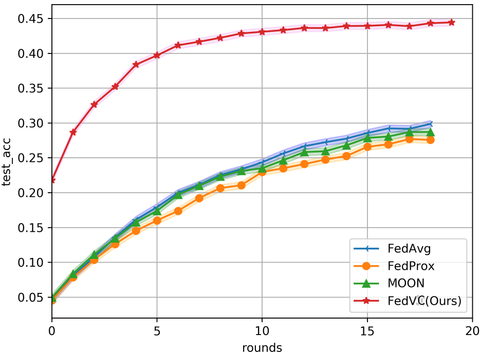
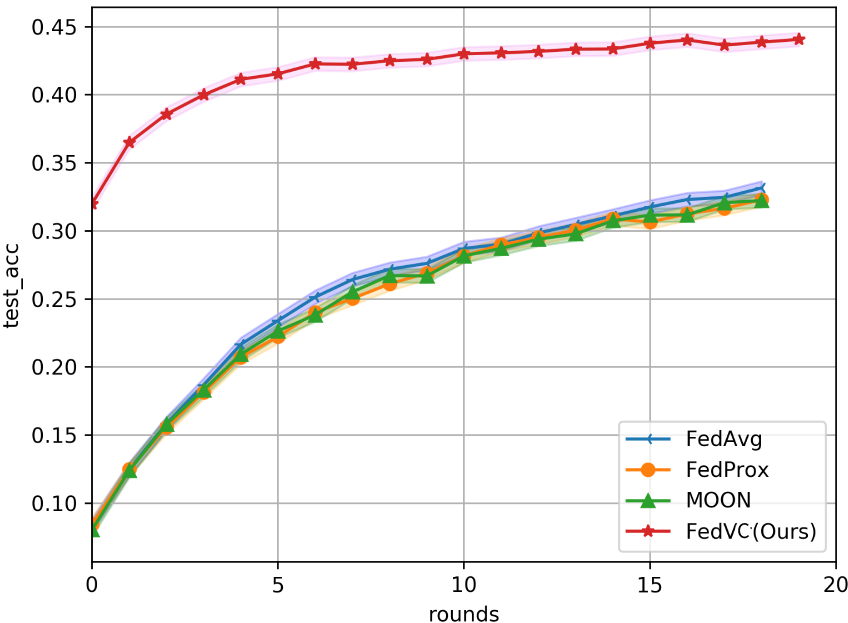
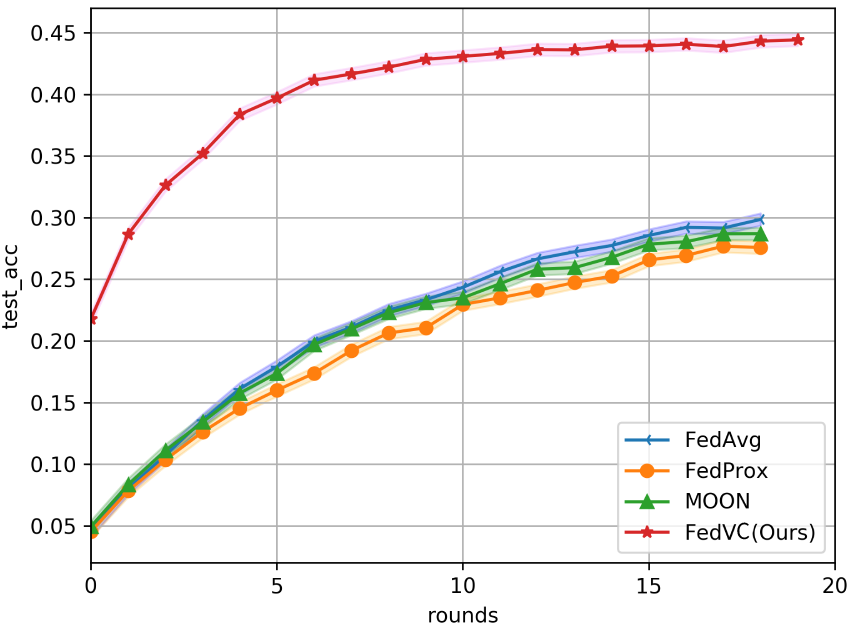
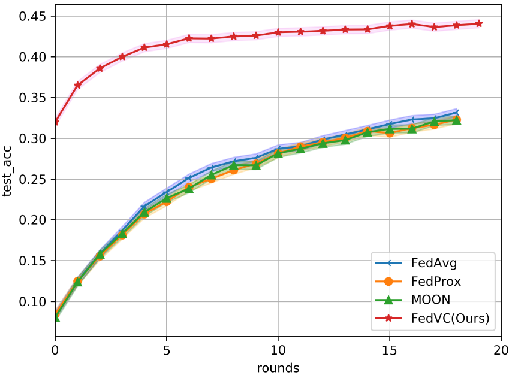

<h1 align="center">FedVC</h1>

<h5 align="center">Virtual Clients for Federated Learning with Imbalanced Distribution</h5>

We are in an early-release beta. Expect some adventures and rough edges.

## Table of Contents

- [Introduction](#introduction)
- [Motivation](#motivation)
- [Experiments Results](#Experiments-Results)
- [Usage](#usage)

## Introduction

Federated Learning (FL) has emerged as a practical paradigm for collaborative training under privacy and communication constraints. However, FL faces various challenges due to the diversity of edge devices. In addition to differences in computing performance and communication efficiency, data distributed on these devices is often imbalanced. While there have been numerous studies on these problems, many introduce additional hyperparameters and communication costs. To address these challenges, we propose an efficient FL method based on virtual clients, a new training framework we have developed. Our approach fills the gap between balanced and imbalanced data distribution by using virtual clients. Our algorithm outperforms classical FedAvg and the state-of-the-art for non-IID data in extensive experiments. Particularly in highly heterogeneous settings, FedVC demonstrates significantly more stable and accurate convergence behavior than other approaches.

## Motivation

The approach to dividing data in federated learning is diverse. Assuming that there is an optimal data division, $\mathcal{D}^{\star}$, which can achieve the best convergence results (i.e., the highest accuracy and best generalization), the goal is to approximate the effect of $\mathcal{D}^{\star}$ in all client training processes. It can be considered that the training process of $\mathcal{D}^{\star}$ achieving good convergence is static, while in another division $\mathcal{D}$, we can try dynamic training methods to approximate the effect of $\mathcal{D}^{\star}$. Further discussion is needed to fully understand dynamic training and its relationship with the $\mathcal{D}^{\star}$ algorithm.

To begin, let's consider the $\mathcal{D}^{\star}$ algorithm. In many open source artificial intelligence datasets, such as CIFAR10 and CIFAR100, the data is uniformly distributed with an equal number of samples for each label. However, when the distribution is non-uniform, the appropriate weights for each sample in $\mathcal{D}^{\star}$ become unknown. Fortunately, there are existing research studies, such as MW-Net, that address this issue by automatically determining the appropriate weights.

## Experiments Results

As shown in the following figures, FedVC demonstrates more stable and accurate convergence behavior than other methods.

## Usage

This repository's code is based on the PaddlePaddle framework. To run it, you should first import it into the aistudio environment.
